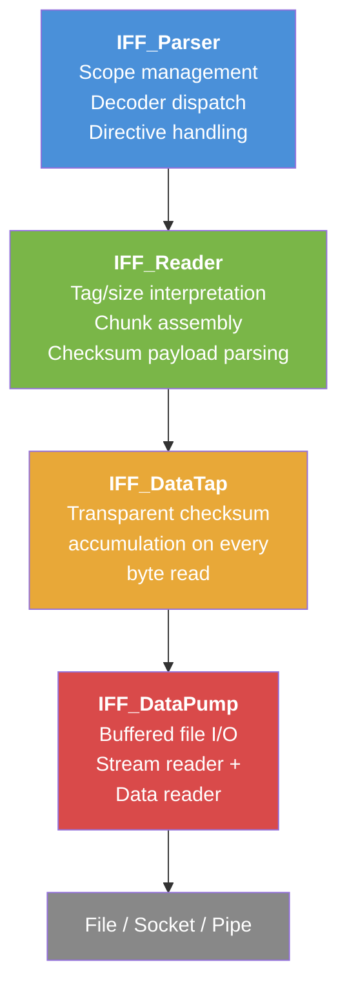
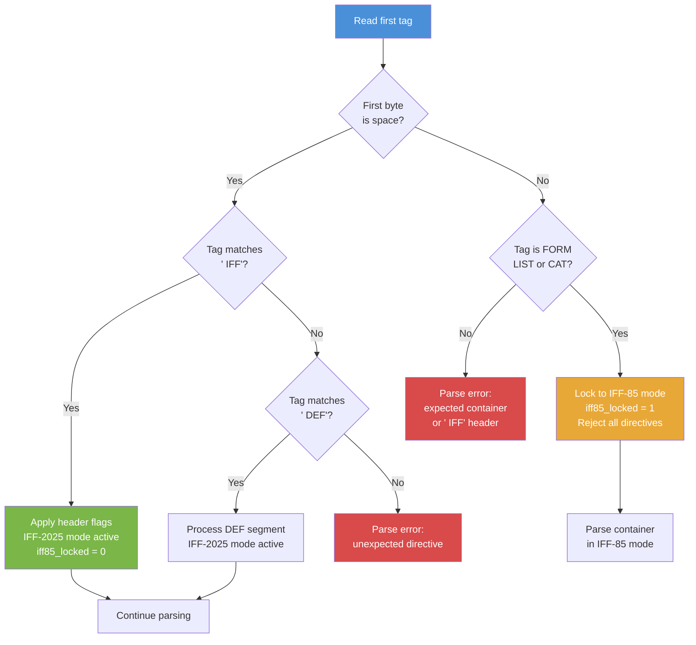
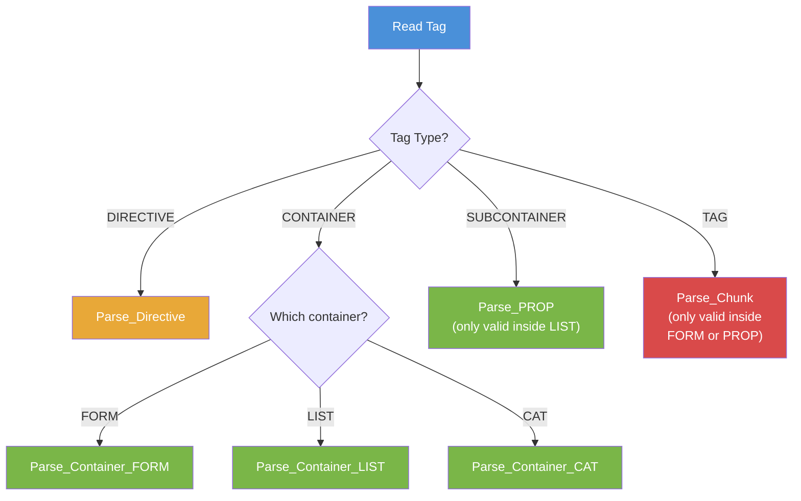
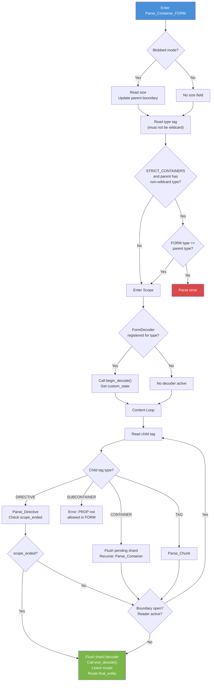
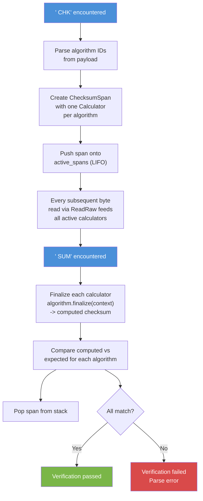
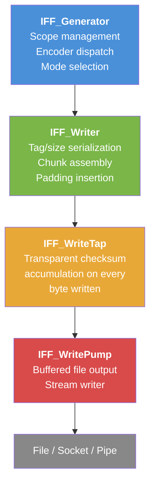
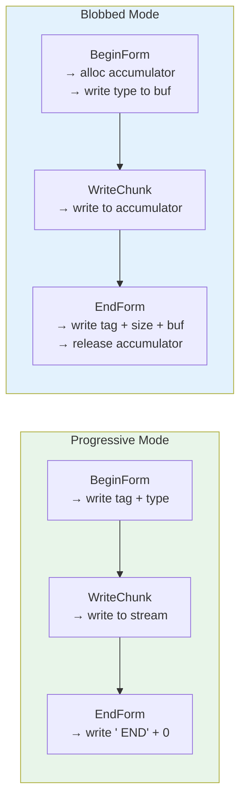
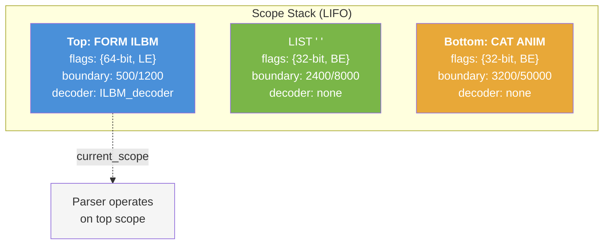
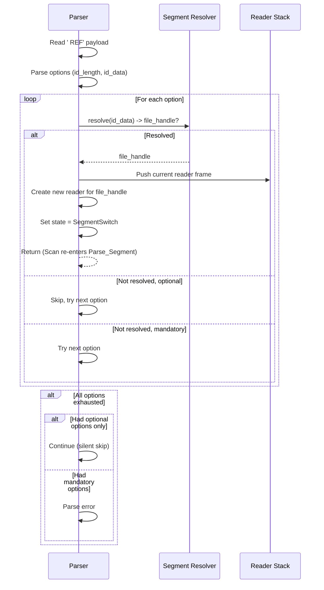

IFF-2025 Implementor's Guide
=============================

### A Practical Guide to Building Compliant Parsers and Generators

**Version**: 1.0
**Companion to**: [IFF-2025 Specification](IFF-2025.md) (normative reference)

---

## How to Read This Guide

This guide is the practical companion to the IFF-2025 specification. Where the
spec defines *what* the format is, this guide explains *how* to build a
compliant parser and generator from scratch.

**Prerequisites**:
- Familiarity with the IFF-2025 specification (Sections 1-11 and Appendix B)
- Understanding of binary file formats and byte-level I/O
- Experience with at least one systems programming language (C, C++, Rust, etc.)

**Conventions used**:
- `monospace` names refer to recommended type and function names
- Pseudocode uses C-like syntax but omits error handling for clarity
- All multi-byte integers are big-endian unless stated otherwise
- "Spec Section N" refers to the normative IFF-2025 specification

---

# Part I: Foundations

## Section 1 — Binary Primitives

### 1.1 Endianness

IFF-2025 defaults to big-endian byte order for all multi-byte integers,
preserving compatibility with IFF-85. Little-endian is available via the
Typing flags in the `' IFF'` header directive (Spec Section 8.3).

Tags are endian-invariant: they are read and written as raw byte sequences,
never interpreted as numeric types. Only size fields and directive payload
integers are affected by the byte-order setting.

### 1.2 Integer Widths

Size fields support three widths:

| Width   | Bytes | Range (signed)         | Range (unsigned)       | Use Case             |
|---------|-------|------------------------|------------------------|----------------------|
| 16-bit  | 2     | -32,768 to 32,767      | 0 to 65,535            | Embedded / small     |
| 32-bit  | 4     | -2 GiB to ~2 GiB       | 0 to ~4 GiB            | Default (IFF-85)     |
| 64-bit  | 8     | ~-9.2 EiB to ~9.2 EiB  | 0 to ~18.4 EiB         | Large data / archive |

The default is 32-bit signed big-endian, matching IFF-85.
Signedness and endianness are independently configurable via the Typing flags.

### 1.3 The `' IFF'` Header Payload

The `' IFF'` directive carries the configuration for a scope. Its payload is
12 bytes:

```
Offset  Size  Field
──────  ────  ──────────────
0       2     Version        (big-endian uint16)
2       2     Revision       (big-endian uint16)
4       8     Flags          (8 bytes, one byte per group)
```

**Version**: `0` = IFF-85 mode (locks out all directives), `40` = IFF-2025
mode (0x0028, calculated as 2025 - 1985).

**Revision**: Currently `0`. Reserved for future minor patches.

### 1.4 The Flags Byte Array

The 8-byte flags field is organized as one byte per functional group.
Each byte is an independent enumeration value, not a traditional bitfield.

```
Byte  Group          Default  Description
────  ─────────────  ───────  ─────────────────────────────────
0     Sizing         0x00     Size field width
1     Tag Sizing     0x00     Tag field width
2     Operating      0x00     Blobbed vs progressive mode
3     Encoding       0x00     Content encoding (reserved)
4     Typing         0x00     Signedness and byte order
5     Structuring    0x00     Padding, sharding, strict mode
6     Reserved       0x00     Future use
7     Reserved       0x00     Future use
```

#### 1.4.1 Sizing (Byte 0)

| Value  | Enum                    | Meaning         |
|--------|-------------------------|-----------------|
| `0x00` | `IFF_Header_Sizing_32`  | 32-bit sizes    |
| `0x01` | `IFF_Header_Sizing_64`  | 64-bit sizes    |
| `0xFF` | `IFF_Header_Sizing_16`  | 16-bit sizes    |

#### 1.4.2 Tag Sizing (Byte 1)

| Value  | Enum                       | Meaning       |
|--------|----------------------------|---------------|
| `0x00` | `IFF_Header_TagSizing_4`   | 4-byte tags   |
| `0x01` | `IFF_Header_TagSizing_8`   | 8-byte tags   |
| `0x02` | `IFF_Header_TagSizing_16`  | 16-byte tags  |

#### 1.4.3 Operating Mode (Byte 2)

| Value  | Enum                           | Meaning                |
|--------|--------------------------------|------------------------|
| `0x00` | `IFF_Header_Operating_BLOBBED` | Sized containers       |
| `0x01` | `IFF_Header_Operating_PROGRESSIVE` | END-terminated     |

#### 1.4.4 Encoding (Byte 3)

| Value  | Enum                           | Meaning                |
|--------|--------------------------------|------------------------|
| `0x00` | `IFF_Header_Encoding_BASE_256` | Raw binary (no transform) |

Reserved for future content encodings.

#### 1.4.5 Typing (Byte 4)

This byte uses bit flags within a single byte:

| Value  | Enum                                    | Meaning              |
|--------|-----------------------------------------|----------------------|
| `0x00` | `IFF_Header_Flag_Typing_DEFAULT`        | Big-endian, signed   |
| `0x01` | `IFF_Header_Flag_Typing_UNSIGNED_SIZES` | Unsigned sizes       |
| `0x02` | `IFF_Header_Flag_Typing_LITTLE_ENDIAN`  | Little-endian sizes  |
| `0x03` | (combined)                              | LE + unsigned        |

#### 1.4.6 Structuring (Byte 5)

This byte uses bit flags:

| Bit | Value  | Enum                                          | Meaning                    |
|-----|--------|-----------------------------------------------|----------------------------|
| 0   | `0x01` | `IFF_Header_Flag_Structuring_NO_PADDING`      | Disable even-byte padding  |
| 1   | `0x02` | `IFF_Header_Flag_Structuring_SHARDING`        | Enable shard via `'    '`  |
| 2   | `0x04` | `IFF_Header_Flag_Structuring_STRICT_CONTAINERS` | Enforce type matching    |

Multiple flags can be combined (e.g., `0x06` = sharding + strict containers).

### 1.5 Helper Functions

Implementations need two conversion helpers that map enum values to byte
counts:

```
GetTagLength(tag_sizing):
    TagSizing_4  -> 4
    TagSizing_8  -> 8
    TagSizing_16 -> 16

GetSizeLength(sizing):
    Sizing_16 -> 2
    Sizing_32 -> 4
    Sizing_64 -> 8
```

---

## Section 2 — The Tag System

### 2.1 Tag Structure

A tag is a fixed-length byte sequence that identifies a chunk or directive.
Internally, implementations should normalize all tags to a canonical form for
uniform comparison and hashing.

Implementations should use a 16-byte canonical representation
(`IFF_TAG_CANONICAL_SIZE = 16`), regardless of the wire tag size. This enables
a 16-byte parser to read 4-byte files without conversion at comparison time.

```c
struct IFF_Tag {
    unsigned char  canonical[16];   // Normalized 16-byte form
    enum IFF_Tag_Type type;         // Classification
};
```

### 2.2 Tag Types

Every tag is classified into one of four types:

| Type           | Enum Value | Description                           | Examples                     |
|----------------|------------|---------------------------------------|------------------------------|
| TAG            | 0          | Data chunk identifier                 | `BMHD`, `BODY`, `CMAP`      |
| CONTAINER      | 1          | Container variant                     | `FORM`, `LIST`, `CAT `       |
| SUBCONTAINER   | 2          | Property container                    | `PROP`                       |
| DIRECTIVE      | 3          | Parser control instruction            | `' IFF'`, `' END'`, `'    '` |

**Classification algorithm**:

1. Read the raw tag bytes from the stream
2. If the first byte is a space (`0x20`): classify as `DIRECTIVE`
3. Otherwise: classify as `TAG`
4. Post-classify by comparing against known container names:
   - If raw bytes match `FORM`, `LIST`, or `CAT `: reclassify as `CONTAINER`
   - If raw bytes match `PROP`: reclassify as `SUBCONTAINER`

This two-phase approach ensures that user-defined tags starting with a space
would be caught as directives (the spec forbids leading spaces in data tags),
while container keywords are recognized regardless of context.

### 2.3 Canonical Normalization

All tags are normalized to a 16-byte canonical form for comparison and hashing.
The normalization rule depends on whether the tag is a data tag or a directive:

**Data tags** (TAG, CONTAINER, SUBCONTAINER) are left-aligned, right-padded
with spaces:

```
Raw 4-byte:  [F][O][R][M]
Canonical:   [F][O][R][M][ ][ ][ ][ ][ ][ ][ ][ ][ ][ ][ ][ ]
             ^offset 0                                       ^offset 15
```

**Directive tags** are right-aligned, left-padded with spaces:

```
Raw 4-byte:  [ ][I][F][F]
Canonical:   [ ][ ][ ][ ][ ][ ][ ][ ][ ][ ][ ][ ][ ][I][F][F]
             ^offset 0                                ^offset 12
```

**Construction pseudocode**:

```
ConstructTag(tag, raw_bytes, raw_size, type):
    memset(tag.canonical, ' ', 16)
    if type == DIRECTIVE:
        offset = 16 - raw_size
        copy raw_bytes to tag.canonical[offset .. offset+raw_size]
    else:
        copy raw_bytes to tag.canonical[0 .. raw_size]
    tag.type = type
```

**The filler/shard tag** (`'    '`, all spaces) normalizes to 16 spaces
regardless of the wire tag size. Since it consists entirely of the padding
character, left-padding and right-padding produce the same result.

### 2.4 Tag Comparison and Hashing

Tags are compared lexicographically on their canonical form. Two tags are equal
if and only if their type fields match AND their 16-byte canonical arrays are
identical.

For dictionary/hash-table lookups, a recommended approach is FNV-1a hashing
over the type byte followed by the 16 canonical bytes:

```
HashTag(tag) -> hash:
    hash = FNV_OFFSET_BASIS
    hash = fnv1a_byte(hash, tag.type)
    for i in 0..15:
        hash = fnv1a_byte(hash, tag.canonical[i])
    return hash
```

### 2.5 Well-Known System Tags

These tags are predefined constants used throughout the implementation:

| Constant                  | Raw (4-byte) | Type         | Purpose                      |
|---------------------------|--------------|--------------|------------------------------|
| `IFF_TAG_SYSTEM_FORM`     | `FORM`       | CONTAINER    | Typed data container         |
| `IFF_TAG_SYSTEM_LIST`     | `LIST`       | CONTAINER    | Grouping with properties     |
| `IFF_TAG_SYSTEM_CAT`      | `CAT `       | CONTAINER    | Concatenation container      |
| `IFF_TAG_SYSTEM_PROP`     | `PROP`       | SUBCONTAINER | Shared properties            |
| `IFF_TAG_SYSTEM_IFF`      | `' IFF'`     | DIRECTIVE    | Configuration header         |
| `IFF_TAG_SYSTEM_END`      | `' END'`     | DIRECTIVE    | Progressive terminator       |
| `IFF_TAG_SYSTEM_SHARD`    | `'    '`     | DIRECTIVE    | Filler or shard              |
| `IFF_TAG_SYSTEM_WILDCARD` | `'    '`     | TAG          | Blank type wildcard          |
| `IFF_TAG_SYSTEM_VER`      | `' VER'`     | DIRECTIVE    | Version (informational)      |
| `IFF_TAG_SYSTEM_REV`      | `' REV'`     | DIRECTIVE    | Revision (informational)     |
| `IFF_TAG_SYSTEM_CHK`      | `' CHK'`     | DIRECTIVE    | Checksum span start          |
| `IFF_TAG_SYSTEM_SUM`      | `' SUM'`     | DIRECTIVE    | Checksum span end            |
| `IFF_TAG_SYSTEM_DEF`      | `' DEF'`     | DIRECTIVE    | Segment identity             |
| `IFF_TAG_SYSTEM_REF`      | `' REF'`     | DIRECTIVE    | Segment reference            |

### 2.6 Container Reclassification

After constructing a tag from raw bytes, the implementation must check whether
the tag is a known container variant. This is done via `memcmp` against the
canonical forms of `FORM`, `LIST`, `CAT `, and `PROP`:

```
ReclassifyTag(tag):
    if tag.type != TAG:
        return   // Only reclassify data-classified tags
    if memcmp(tag.canonical, SYSTEM_FORM.canonical, 16) == 0:
        tag.type = CONTAINER
    else if memcmp(tag.canonical, SYSTEM_LIST.canonical, 16) == 0:
        tag.type = CONTAINER
    else if memcmp(tag.canonical, SYSTEM_CAT.canonical, 16) == 0:
        tag.type = CONTAINER
    else if memcmp(tag.canonical, SYSTEM_PROP.canonical, 16) == 0:
        tag.type = SUBCONTAINER
```

Note: Directives are already classified by the leading-space check before
reclassification runs, so `FORM`/`LIST`/`CAT `/`PROP` are only reclassified
from `TAG`, never from `DIRECTIVE`.

---

## Section 3 — Chunk Anatomy

### 3.1 Chunk Layout

Every chunk follows the same fundamental layout:

```
┌──────────┬──────────┬───────────────────┬──────────┐
│   Tag    │   Size   │     Payload       │ Padding? │
│ (N bytes)│ (M bytes)│   (Size bytes)    │ (0-1 B)  │
└──────────┴──────────┴───────────────────┴──────────┘
```

Where:
- **Tag**: `N` = 4, 8, or 16 bytes (per current `tag_sizing`)
- **Size**: `M` = 2, 4, or 8 bytes (per current `sizing`)
- **Payload**: Exactly `Size` bytes of data
- **Padding**: 1 byte of zero if `Size` is odd and `NO_PADDING` is not set

### 3.2 Size Field Interpretation

The size field is read according to the active scope's flags:

```
ReadSize(sizing, typing) -> value:
    raw_bytes = ReadRaw(GetSizeLength(sizing))
    if typing has LE flag:
        value = interpret_little_endian(raw_bytes)
    else:
        value = interpret_big_endian(raw_bytes)
    // Signedness affects the maximum representable positive value
    // but negative sizes are invalid; parsers should reject them
    return value
```

### 3.3 Padding Rules

By default (IFF-85 compatible), all chunks are padded to even-byte boundaries.
After reading `Size` bytes of payload, if `Size` is odd, the parser reads and
discards 1 byte of padding.

When `NO_PADDING` is set in the Structuring flags, padding is disabled entirely.
Chunks can end on odd boundaries.

The padding byte is included in the parent container's boundary tracking but is
NOT part of the chunk's declared size.

### 3.4 Container Layout

Containers differ from chunks in two ways: they include a type tag after the
size (or after the variant tag in progressive mode), and their payload consists
of nested components rather than raw data.

**Blobbed mode** (sized containers):

```
┌──────────┬──────────┬──────────┬─────────────────────┬──────────┐
│ Variant  │   Size   │   Type   │   Nested Content    │ Padding? │
│ (N bytes)│ (M bytes)│ (N bytes)│ (chunks/containers) │ (0-1 B)  │
└──────────┴──────────┴──────────┴─────────────────────┴──────────┘
```

**Progressive mode** (END-terminated containers):

```
┌──────────┬──────────┬─────────────────────┬──────────────────┐
│ Variant  │   Type   │   Nested Content    │ ' END' tag + 0   │
│ (N bytes)│ (N bytes)│ (chunks/containers) │ (N + M bytes)    │
└──────────┴──────────┴─────────────────────┴──────────────────┘
```

Note: In progressive mode, the size field is absent for containers, but chunks
within still have size fields for their payloads.

---

# Part II: Read Path

## Section 4 — I/O Stack Architecture

The read path uses a four-layer decorator pattern. Each layer adds a specific
concern without the layers above or below needing awareness of it.



### 4.1 IFF_DataPump — Raw I/O

The bottom layer wraps a stream reader and provides buffered byte access.

**State**: stream reader, working data buffer, sequential data reader

**API surface**:
- `ReadRaw(bytes_to_read) -> data` — Ensure bytes available, clone and return
- `Skip(bytes_to_skip)` — Ensure bytes available, advance read position

The pump handles buffer compaction internally: when the read position advances
past consumed data, it compacts the buffer and refills from the stream.

### 4.2 IFF_DataTap — Checksum Layer

A transparent decorator that feeds every byte read to all active checksum
calculators before passing the data upward.

**State**: pump (owned), registered algorithms dictionary, active spans list
(LIFO)

**API surface**:
- `ReadRaw(bytes_to_read) -> data` — Delegates to pump, then feeds data to all
  active spans
- `Skip(bytes_to_skip)` — Reads bytes (to feed checksums) rather than truly
  skipping
- `RegisterAlgorithm(algorithm)` — Adds an algorithm to the available set
- `StartSpan(algorithm_ids)` — Creates and pushes a new checksum span
- `EndSpan(expected_checksums) -> success` — Finalizes calculators, compares
  results

When no checksum spans are active, the tap is zero-overhead — it simply
delegates to the pump. See Section 8 for the full checksum lifecycle.

### 4.3 IFF_Reader — Interpretation Layer

Converts raw bytes into meaningful IFF primitives: tags, sizes, chunks, and
checksum span operations.

**State**: tap (owned), content decoders dictionary (for future encoding
support)

**API surface**:
- `ReadTag(tag_sizing) -> tag` — Read raw bytes, classify, normalize to
  canonical form
- `ReadSize(sizing, typing) -> size` — Read and interpret per active flags
- `ReadData(encoding, size) -> data` — Read payload (currently pass-through)
- `ReadChunk(config, tag) -> chunk` — Assemble a complete chunk (size + data)
- `Skip(bytes_to_skip)` — Delegate skip
- `StartChecksumSpan(config, chk_payload)` — Parse `' CHK'` payload, delegate
  to tap
- `EndChecksumSpan(config, sum_payload)` — Parse `' SUM'` payload, verify via
  tap
- `ReadPayloadSize(data_reader, config) -> size` — Shared helper for parsing
  size fields within already-read directive payloads
- `IsActive()` — Whether the underlying stream has data remaining

### 4.4 IFF_Parser — Orchestration Layer

The top layer owns the parse loop, scope stack, decoder registries, and
session state machine.

**State**: session, reader (owned), decoder dictionaries (form, chunk,
directive), reader stack (for segment inclusion), segment resolver callback

**API surface**:
- `Scan()` — Main entry point: loops segments until Complete or Failed
- `ExecuteDirective(chunk)` — Process a directive via registered processor
- `SetSegmentResolver(callback, context)` — Configure segment reference
  resolution

---

## Section 5 — Bootstrapping

### 5.1 Session State Machine

The parser session tracks its overall state:

| State            | Meaning                                        |
|------------------|------------------------------------------------|
| `Idle`           | Initial state before any parsing               |
| `Segment`        | Actively reading a segment                     |
| `SegmentSwitch`  | Between included segments (reader stack pop)    |
| `Complete`       | Clean termination (EOF or all segments done)    |
| `Failed`         | Parse error encountered                        |

`IsActive()` returns true when the state is not `Failed`, `Complete`, or
`SegmentSwitch`.

### 5.2 Initial Configuration

The parser starts in **pseudo IFF-85 mode**: IFF-2025 version 40 with all
flags zeroed. This is equivalent to an `' IFF'` directive payload of:

```
Version=0x0028  Revision=0x0000  Flags=0x0000000000000000
```

All flags at zero means: 32-bit sizes, 4-byte tags, blobbed mode, big-endian,
signed, padding enabled, no sharding, no strict containers. This matches
IFF-85 behavior exactly while keeping the door open for IFF-2025 directives.

### 5.3 Bootstrap Decision Tree

The parser's first tag determines the operating mode for the entire stream:



### 5.4 The `parsing_resumed` Flag

When the parser resumes after popping an included segment's reader (see
Section 13), the `parsing_resumed` flag is set. This prevents the bootstrap
logic from re-evaluating the first tag — the next tag encountered after
resumption should not trigger IFF-85 locking, since the mode was already
established before the inclusion.

### 5.5 IFF-85 Locking

When `iff85_locked` is set, the directive handler rejects all directives
except `'    '` in filler mode (which is harmless padding). This enforces
strict IFF-85 semantics: no configuration changes, no progressive mode, no
checksums, no segmentation.

---

## Section 6 — The Parse Loop

### 6.1 Entry Point: `Scan`

The main entry point loops until the session reaches a terminal state:

```
Scan(parser):
    while session.state != Failed AND session.state != Complete:
        Parse_Segment(parser)
        if session.state == SegmentSwitch:
            continue   // Re-enter segment after reader swap
    return (session.state != Failed)
```

### 6.2 Segment Parsing

`Parse_Segment` is the core loop that reads tags and dispatches based on type:

```
Parse_Segment(parser):
    session.state = Segment
    is_first_tag = true

    while reader.IsActive() AND session.IsBoundaryOpen():
        // Read the next tag
        tag = reader.ReadTag(current_flags.tag_sizing)
        if read failed:
            if reader stack is not empty:
                PopReaderAndRestore()    // EOF during inclusion
                session.parsing_resumed = true
                continue
            else:
                session.state = Complete
                return

        // Bootstrap: detect IFF-85 on first tag
        if is_first_tag AND NOT session.parsing_resumed:
            if tag.type == CONTAINER:
                session.iff85_locked = true
        is_first_tag = false
        session.parsing_resumed = false

        // Update boundary for the tag we just consumed
        boundary.level += GetTagLength(current_flags.tag_sizing)

        // Dispatch based on tag type
        switch tag.type:
            case DIRECTIVE:   Parse_Directive(tag)
            case CONTAINER:   Parse_Container(tag)
            case TAG:         // ERROR: data chunk at root level
            case SUBCONTAINER: // ERROR: PROP at root level

    session.state = Complete
```

### 6.3 Parse Dispatch



### 6.4 Container Parsing (FORM)

FORM is the most complex container. Its lifecycle:



**Container content validation rules**:

| Content Type      | FORM | LIST | CAT  | PROP |
|-------------------|------|------|------|------|
| Data chunks (TAG) | Yes  | No   | No   | Yes  |
| Nested FORM       | Yes  | Yes  | Yes  | No   |
| Nested LIST       | Yes  | Yes  | Yes  | No   |
| Nested CAT        | Yes  | Yes  | Yes  | No   |
| PROP              | No   | Yes  | No   | No   |
| Directives        | Yes  | Yes  | Yes  | Yes  |

### 6.5 Container Parsing (LIST)

LIST parsing follows the same general pattern as FORM but with different
content rules:

1. Read size (blobbed) and type tag
2. Enter scope (no FormDecoder for LIST)
3. Content loop accepts: directives, containers (FORM/LIST/CAT), and PROPs
4. Data chunks at LIST level are rejected
5. On scope exit, leave scope and clean up

### 6.6 Container Parsing (CAT)

CAT is the simplest container:

1. Read size (blobbed) and type tag
2. Enter scope
3. Content loop accepts: directives and containers only
4. Data chunks and PROPs are rejected
5. Leave scope on exit

### 6.7 PROP Parsing

PROP is a flat subcontainer — it cannot nest other containers:

1. Read size (blobbed) and type tag (may be wildcard `'    '`)
2. Enter scope
3. Content loop accepts: directives and data chunks only
4. Data chunks are stored in the session's scoped property dictionary
   using a composite key of `(form_type, chunk_tag)`
5. Leave scope on exit

### 6.8 Data Chunk Parsing

Chunk parsing handles the decoder lifecycle:

```
Parse_Chunk(parser, tag):
    // Read chunk body
    chunk = reader.ReadChunk(config, tag)
    boundary.level += size_len + chunk.size
    if odd(chunk.size) AND NOT NO_PADDING:
        reader.Skip(1)
        boundary.level += 1

    // Look up decoder
    key = ChunkKey(current_scope.container_type, tag)
    decoder = chunk_decoders.lookup(key)

    if decoder found:
        if SHARDING:
            FlushPendingShardDecoder()
            decoder.begin_decode(state) -> custom_state
            decoder.process_shard(state, custom_state, chunk.data)
            // Store decoder+state for continuation via '    ' shards
            scope.last_chunk_decoder = decoder
            scope.last_chunk_state = custom_state
            scope.last_chunk_tag = tag
        else:
            decoder.begin_decode(state) -> custom_state
            decoder.process_shard(state, custom_state, chunk.data)
            decoder.end_decode(state, custom_state) -> result
            RouteResult(result)

    else if in PROP scope:
        // Store raw chunk data as property
        session.AddProp(scope.container_type, tag, ContextualData(flags, chunk.data))
    else:
        // No decoder registered; skip
        release chunk.data
```

### 6.9 Boundary Tracking

Each scope maintains a boundary with `level` (bytes consumed) and `limit`
(maximum allowed):

- **Blobbed mode**: `limit` is set from the container's declared size.
  The content loop exits when `level >= limit`.
- **Progressive mode**: `limit` is 0 (unbounded). The content loop exits
  when an `' END'` directive is encountered.

The boundary level accumulates:
- Tag bytes (when each child tag is read)
- Size field bytes + payload bytes (when a chunk is read)
- Padding bytes (1 byte for odd-sized chunks when padding is enabled)

`IsBoundaryOpen()` returns true when `limit == 0` (unbounded) or
`level < limit`.

---

## Section 7 — Directive Handling

### 7.1 Directive Processing Overview

When the parse loop encounters a directive tag, it dispatches to
`Parse_Directive`. Some directives are handled directly by the parser
(built-in), while others are delegated to registered processors.

**IFF-85 lock guard**: If `iff85_locked` is set, all directives are rejected
except `'    '` in filler mode (non-sharding). This prevents IFF-85 streams
from being corrupted by directive interpretation.

### 7.2 Directive Reference Table

| Directive  | Handling    | Action                                          |
|------------|-------------|-------------------------------------------------|
| `' END'`   | Built-in    | Terminate current container (progressive mode)  |
| `' CHK'`   | Built-in    | Start a checksum span                           |
| `' SUM'`   | Built-in    | End a checksum span + verify                    |
| `'    '`   | Built-in    | Filler (skip) or shard (feed to decoder)        |
| `' IFF'`   | Registered  | Update scope flags (with guards)                |
| `' DEF'`   | Registered  | Read segment identity (informational skip)      |
| `' REF'`   | Built-in    | Resolve and include external segment            |
| `' VER'`   | Registered  | Read version (informational skip)               |
| `' REV'`   | Registered  | Read revision (informational skip)              |
| Unknown    | Registered  | Forward-compatible: read and skip               |

### 7.3 `' IFF'` Header Processing

The `' IFF'` directive processor parses the 12-byte payload and returns an
`UPDATE_FLAGS` action with the new flags. The parser then applies scope guards
before updating:

**Scope guards** (applied in the parser, not the processor):

1. **Size widening check**: The new sizing must not exceed the parent scope's
   sizing. A child scope cannot use 64-bit sizes if its parent uses 32-bit,
   because the parent's boundary was declared with the narrower type.

2. **Tag widening check**: The new tag sizing must not exceed the parent's.
   Similar rationale — wider tags would consume more boundary bytes than the
   parent allocated.

3. **Blobbed-to-progressive check**: Switching from blobbed to progressive
   mode requires that the parent can accommodate the `' END'` directive that
   will terminate the progressive container. If the parent's remaining
   boundary space is insufficient, the switch is rejected.

If all guards pass, the current scope's flags are updated. The changes take
effect immediately for subsequent reads and revert when the scope exits.

### 7.4 `' END'` Progressive Terminator

Handled directly in `Parse_Directive`:

```
Handle_END(parser, tag):
    size = reader.ReadSize(config.sizing, config.typing)
    boundary.level += GetSizeLength(config.sizing)
    if size != 0:
        return error  // ' END' must have size 0
    scope_ended = true
```

The `scope_ended` flag is checked by the calling container's content loop,
which then exits and finalizes the scope.

### 7.5 `' CHK'` / `' SUM'` Checksum Directives

Handled directly. The parser reads the directive as a chunk, updates the
boundary, and delegates to the reader's checksum functions:

```
Handle_CHK(parser, tag):
    chunk = reader.ReadChunk(config, tag)
    boundary.level += size_len + chunk.size
    if odd(chunk.size) AND NOT NO_PADDING:
        reader.Skip(1)
        boundary.level += 1
    reader.StartChecksumSpan(config, chunk.data)

Handle_SUM(parser, tag):
    chunk = reader.ReadChunk(config, tag)
    boundary.level += size_len + chunk.size
    if odd(chunk.size) AND NOT NO_PADDING:
        reader.Skip(1)
        boundary.level += 1
    success = reader.EndChecksumSpan(config, chunk.data)
    if NOT success:
        return error  // Checksum mismatch
```

### 7.6 `'    '` Filler/Shard Dual Role

The all-spaces tag serves two purposes depending on the `SHARDING` flag:

**Filler mode** (SHARDING not set): The directive payload is read and
discarded. This allows files to include alignment padding.

**Shard mode** (SHARDING set): The directive payload is fed to the most recent
chunk's decoder via `process_shard()`. This enables a single logical chunk to
be split across multiple physical chunks — useful for network fragments or
interleaved data streams.

```
Handle_FILLER_SHARD(parser, tag):
    chunk = reader.ReadChunk(config, tag)
    boundary.level += size_len + chunk.size
    if odd(chunk.size) AND NOT NO_PADDING:
        reader.Skip(1)
        boundary.level += 1

    if SHARDING:
        if scope.last_chunk_decoder != NULL:
            scope.last_chunk_decoder.process_shard(
                state, scope.last_chunk_state, chunk.data)
    // else: filler — discard data
```

### 7.7 `' DEF'` / `' REF'` Segmentation Directives

`' DEF'` declares the identity of the current segment and is read-and-skipped
(processed via a registered handler that returns `CONTINUE`).

`' REF'` triggers segment inclusion and is handled directly by the parser.
See Section 13 for full details.

### 7.8 `' VER'` / `' REV'` Informational Directives

These are non-normative. The spec notes they can be replaced with a no-op
implementation. A compliant parser reads and skips them via registered
processors that return `CONTINUE`.

### 7.9 Unknown Directives

For forward compatibility, any unrecognized directive tag is read as a chunk
and skipped. If a processor is registered for it, the processor is called;
otherwise the data is discarded. This allows older parsers to handle files
with newer directive types.

### 7.10 The Directive Processor Pattern

Registered processors follow a command pattern:

```
Process(chunk) -> DirectiveResult:
    result.action = one of:
        CONTINUE          // No parser action needed
        STOP_SCOPE        // Stop parsing current scope
        UPDATE_FLAGS      // Update scope flags (payload: new_flags)
        START_CHECKSUM    // Start checksum span (payload: algorithm_ids)
        END_CHECKSUM      // End checksum span (payload: expected_checksums)
        HALT              // Fatal error, stop all parsing
```

The parser's `ExecuteDirective` function calls the processor, then interprets
the result's action code to update state accordingly.

---

## Section 8 — Checksum Verification

### 8.1 CHK/SUM Payload Formats

The `' CHK'` directive payload identifies which algorithms to use:

```
Offset  Field
──────  ──────────────────────
0       version              (size-field width, currently 1)
+M      num_algorithms       (size-field width)
        For each algorithm:
+M          id_length        (size-field width)
+id_len     id_data          (ASCII identifier string)
```

The `' SUM'` directive payload includes both identifiers and expected values:

```
Offset  Field
──────  ──────────────────────
0       version              (size-field width, currently 1)
+M      num_algorithms       (size-field width)
        For each algorithm:
+M          id_length        (size-field width)
+id_len     id_data          (ASCII identifier string)
+M          checksum_length  (size-field width)
+chk_len    checksum_data    (big-endian checksum bytes)
```

Note: The size fields within these payloads use the same width (`M`) as
configured by the current scope's sizing flags. The `ReadPayloadSize` helper
reads these embedded sizes.

### 8.2 DataTap Span Lifecycle



**Key invariant**: The `' SUM'` directive's own bytes are NOT included in the
checksum calculation. The span ends before the SUM payload is checksummed —
specifically, `EndSpan` is called after parsing the SUM data but the span was
already finalized by that point. On the write side, the span is ended before
the SUM directive is written.

### 8.3 LIFO Nesting

Multiple checksum spans can be active simultaneously. They nest in LIFO order:
the most recently started span is the first to be ended. Every byte read feeds
ALL active spans, not just the innermost one. This means an outer span's
checksum covers the inner span's CHK/SUM directives as well.

### 8.4 The Algorithm Vtable

Each checksum algorithm is represented by a vtable with four functions:

```c
struct IFF_ChecksumAlgorithm {
    const char* identifier;          // e.g., "CRC-32C"
    uint8_t     output_size;         // Checksum size in bytes

    char (*create_context)(void** context);
    void (*update)(void* context, const Data* data);
    char (*finalize)(void* context, Data* out_checksum);
    void (*release_context)(void* context);
};
```

The Calculator wraps an algorithm with a live context:

```c
struct IFF_ChecksumCalculator {
    const IFF_ChecksumAlgorithm* algorithm;  // Borrowed reference
    void* context;                            // Owned, algorithm-specific
};
```

Construction calls `algorithm->create_context()` to initialize state.
Destruction calls `algorithm->release_context()` to clean up.

The Span holds a list of calculators, one per algorithm requested by the
`' CHK'` directive:

```c
struct IFF_ChecksumSpan {
    List* calculators;       // List of IFF_ChecksumCalculator
};
```

### 8.5 Algorithm Bill of Materials

| Algorithm     | Identifier       | Output  | Polynomial / Method                | Notes                        |
|---------------|------------------|---------|------------------------------------|------------------------------|
| LRC-ISO-1155  | `"LRC-ISO-1155"` | 8 bits  | XOR of all bytes                   | Simplest, minimal overhead   |
| RFC-1071      | `"RFC-1071"`     | 16 bits | One's complement sum of 16-bit words | Lightweight, network-style |
| CRC-32C       | `"CRC-32C"`      | 32 bits | Castagnoli: `0x1EDC6F41`          | Reflected (LSB-first)        |
| CRC-64/ECMA   | `"CRC64-ECMA"`   | 64 bits | ECMA-182: `0x42F0E1EBA9EA3693`   | MSB-first (non-reflected)    |

### 8.6 CRC Implementation Notes

**CRC-32C** uses reflected (LSB-first) processing. The reflected polynomial is
`0x82F63B78`. Implementations typically use a 256-entry lookup table generated
from this polynomial. Each byte is XORed into the low byte of the CRC register,
then the register is shifted right 8 bits and XORed with the table entry.

**CRC-64/ECMA** uses MSB-first (non-reflected) processing with polynomial
`0x42F0E1EBA9EA3693`. Each byte is XORed into the high byte of the CRC
register, then the register is shifted left 8 bits and XORed with the table
entry.

**All outputs are big-endian**: Regardless of the scope's byte-order setting,
checksum values in `' SUM'` payloads are always stored in big-endian byte
order. This ensures consistent verification across endianness configurations.

---

# Part III: Write Path

## Section 9 — Write Stack Architecture

The write path mirrors the read path with an inverted decorator stack:



### 9.1 Write Path / Read Path Correspondence

| Write-Side             | Read-Side             | Role                          |
|------------------------|-----------------------|-------------------------------|
| `IFF_WritePump`        | `IFF_DataPump`        | Raw I/O                       |
| `IFF_WriteTap`         | `IFF_DataTap`         | Checksum accumulation         |
| `IFF_Writer`           | `IFF_Reader`          | Tag/size/data interpretation  |
| `IFF_WriteScope`       | `IFF_Scope`           | Per-container state           |
| `IFF_Generator`        | `IFF_Parser`          | High-level orchestration      |
| `IFF_FormEncoder`      | `IFF_FormDecoder`     | FORM vtable                   |
| `IFF_ChunkEncoder`     | `IFF_ChunkDecoder`    | Chunk vtable                  |
| `IFF_Generator_Factory`| `IFF_Parser_Factory`  | Builder pattern               |
| `IFF_Generator_State`  | `IFF_Parser_State`    | Encoder/decoder-facing view   |

The checksum infrastructure (`IFF_ChecksumAlgorithm`, `IFF_ChecksumCalculator`,
`IFF_ChecksumSpan`) is shared between both paths.

---

## Section 10 — Two Operating Modes

### 10.1 Progressive Mode

In progressive mode, containers have no declared size and are terminated by
`' END'` directives. Data flows directly from the generator through the writer
to the output stream.

```
BeginForm(type):
    Write FORM tag to stream
    Write type tag to stream
    Push scope (no accumulator)

WriteChunk(tag, data):
    Write tag + size + data + padding to stream

EndForm():
    Write ' END' tag + size=0 to stream
    Pop scope
```

**Advantages**: True streaming — no memory accumulation, immediate output.
Suitable for real-time data, pipes, and append-only files.

**Disadvantage**: Cannot produce IFF-85-compatible blobbed output (no declared
container sizes).

### 10.2 Blobbed Mode

In blobbed mode, containers include explicit sizes. Since the output stream may
be non-seekable (pipe, socket, network), sizes cannot be backpatched. Instead,
container contents accumulate in memory buffers until the container is closed.

```
BeginForm(type):
    Allocate accumulator buffer
    Create data writer wrapping accumulator
    Write type tag into accumulator
    Push scope (with accumulator)

WriteChunk(tag, data):
    Write tag + size + data + padding into accumulator

EndForm():
    body_size = accumulator.length
    Write FORM tag + size(body_size) + accumulator contents
        to parent (stream or parent's accumulator)
    Release accumulator
    Pop scope
```

**Advantages**: Produces standard IFF-85 compatible files. Supports
non-seekable output.

**Disadvantage**: Entire container must fit in memory before writing.

### 10.3 Mode Comparison



### 10.4 Nested Blobbed Containers

When a blobbed container is nested inside another blobbed container, each
level maintains its own accumulator:

1. Inner FORM accumulates into its own buffer
2. On `EndForm`, the inner FORM's complete serialization (tag + size + body)
   is appended to the outer container's accumulator
3. On the outer container's `End`, its accumulator (containing all nested
   content) is written to the stream (or to a grandparent's accumulator)

This handles arbitrary nesting depth naturally. Memory usage equals the sum of
all ancestor accumulators on the current nesting path.

### 10.5 Output Target Abstraction

The generator's internal `Emit*` helpers check the current scope to determine
the output target:

```
EmitTag(scope, tag_sizing, tag):
    if scope has accumulator_writer:
        serialize tag into accumulator_writer
    else:
        writer.WriteTag(tag_sizing, tag)
```

This pattern keeps the container lifecycle code (`BeginForm`, `WriteChunk`,
`EndForm`) largely mode-agnostic. The same logic applies to `EmitSize`,
`EmitData`, `EmitRaw`, `EmitPadding`, and `EmitChunk`.

---

## Section 11 — Generator API Walkthrough

### 11.1 Container Lifecycle

The generator provides matched Begin/End pairs for each container type:

| Function          | Variant Tag | Content Rules                              |
|-------------------|---------|--------------------------------------------|
| `BeginForm/EndForm` | `FORM`  | Chunks + nested containers + directives    |
| `BeginList/EndList` | `LIST`  | PROPs + nested containers + directives     |
| `BeginCat/EndCat`   | `CAT `  | Nested containers + directives only        |
| `BeginProp/EndProp` | `PROP`  | Chunks + directives only (no nesting)      |

Each `Begin` call:
1. Validates the container is allowed in the current context
2. Creates and pushes a new `IFF_WriteScope`
3. In progressive mode: emits the variant tag and type tag immediately
4. In blobbed mode: writes the type tag into the accumulator

Each `End` call:
1. In progressive mode: emits an `' END'` directive (tag + size=0)
2. In blobbed mode: emits the variant tag + size + accumulated body to the
   parent target
3. Updates the parent scope's `bytes_written`
4. Pops and releases the scope

### 11.2 Content-Type Validation

The generator enforces the same content rules as the parser:

| Operation        | FORM | LIST | CAT  | PROP | Root |
|------------------|------|------|------|------|------|
| `WriteChunk`     | Yes  | No   | No   | Yes  | No   |
| `BeginForm`      | Yes  | Yes  | Yes  | No   | Yes  |
| `BeginList`      | Yes  | Yes  | Yes  | No   | Yes  |
| `BeginCat`       | Yes  | Yes  | Yes  | No   | Yes  |
| `BeginProp`      | No   | Yes  | No   | No   | No   |
| `WriteHeader`    | No   | No   | No   | No   | Yes  |
| `WriteDEF/REF`   | No   | No   | No   | No   | Yes  |

### 11.3 STRICT_CONTAINERS Enforcement

When `STRICT_CONTAINERS` is active (Structuring bit 2), `BeginForm` validates
that the FORM's type tag matches the parent container's declared type. This
only applies when the parent is a CAT or LIST with a non-wildcard type.

### 11.4 WriteChunk and Byte Tracking

`WriteChunk(gen, tag, data)` emits a complete chunk (tag + size + data +
optional padding) and updates the current scope's `bytes_written`:

```
bytes_written += tag_len + size_len + data.length
if odd(data.length) AND NOT NO_PADDING:
    bytes_written += 1
```

### 11.5 Directive Emission

The generator provides dedicated functions for each writable directive:

- `WriteHeader(header)` — Writes `' IFF'` with version/revision/flags payload.
  Validates that no container scope is open (header is root-level only).
  Updates the generator's active flags.

- `WriteDEF(identifier)` — Writes `' DEF'` segment identity at root level.

- `WriteREF(num_options, identifiers[])` — Writes `' REF'` segment references
  at root level.

- `WriteFiller(size)` — Writes `'    '` with zero-filled payload.

- `WriteShard(data)` — Writes `'    '` with payload. Requires `SHARDING` flag.

- `WriteVER(data)` / `WriteREV(data)` — Writes informational version/revision
  directives.

### 11.6 Checksum Generation

**Progressive mode**: The WriteTap handles checksum calculation transparently.

1. `BeginChecksumSpan(algorithm_ids)`:
   - Builds and emits the `' CHK'` directive with algorithm identifiers
   - Calls `WriteTap_StartSpan()` — all subsequent bytes flow through
     calculators

2. (Write chunks, containers, etc. — all bytes are checksummed)

3. `EndChecksumSpan()`:
   - Calls `WriteTap_EndSpan()` — finalizes calculators, returns computed
     checksums
   - Builds and emits the `' SUM'` directive with computed values
   - The SUM bytes are written AFTER the span ends, so they are not included
     in the checksum (matching spec semantics)

**Blobbed mode**: Writes go to in-memory accumulators rather than through the
WriteTap, so the tap's calculators do not see the data. The generator maintains
a separate `blobbed_spans` LIFO stack of span tracking structures. Each entry
stores a reference to the accumulator and the start offset. On
`EndChecksumSpan`, the generator extracts the byte range from the accumulator
and feeds it to the calculators in one batch.

### 11.7 Flush and Finalization

`Flush(gen)` validates that all state is clean:

- No open container scopes remain on the stack
- No open checksum spans remain
- The underlying writer/pump buffers are flushed to the output

If any of these conditions fail, `Flush` returns an error.

---

# Part IV: Advanced Topics

## Section 12 — Scope Management & Property Resolution

### 12.1 The Scope Stack

Each container entry pushes a new scope onto a LIFO stack. The scope captures
the configuration and state active within that container.



### 12.2 Scope Fields (Read Path)

Each `IFF_Scope` contains:

| Field                | Type                | Purpose                                |
|----------------------|---------------------|----------------------------------------|
| `flags`              | `IFF_Header_Flags`  | Active parsing configuration           |
| `boundary`           | `IFF_Boundary`      | `level` / `limit` tracking             |
| `container_variant`  | `IFF_Tag`           | The variant tag (FORM/LIST/CAT/PROP)   |
| `container_type`     | `IFF_Tag`           | The type tag (e.g., ILBM, or wildcard) |
| `form_decoder`       | `IFF_FormDecoder*`  | Active FORM decoder (NULL if none)     |
| `form_state`         | `void*`             | FormDecoder's custom state             |
| `last_chunk_decoder` | `IFF_ChunkDecoder*` | Pending chunk decoder (sharding)       |
| `last_chunk_state`   | `void*`             | Pending decoder's state                |
| `last_chunk_tag`     | `IFF_Tag`           | Tag of the pending chunk               |

### 12.3 Scope Fields (Write Path)

Each `IFF_WriteScope` contains:

| Field                | Type                | Purpose                                |
|----------------------|---------------------|----------------------------------------|
| `flags`              | `IFF_Header_Flags`  | Active writing configuration           |
| `container_variant`  | `IFF_Tag`           | The variant tag (FORM/LIST/CAT/PROP)   |
| `container_type`     | `IFF_Tag`           | The type tag                           |
| `accumulator`        | `Data*`             | Blobbed mode buffer (NULL if progressive) |
| `accumulator_writer` | `DataWriter*`       | Writer for accumulator                 |
| `bytes_written`      | size                | Total bytes written in this scope      |
| `form_encoder`       | `IFF_FormEncoder*`  | Active FORM encoder                    |
| `form_state`         | `void*`             | FormEncoder's custom state             |

### 12.4 PROP Storage and Resolution

Properties are stored in a scoped dictionary that
mirrors the scope stack. The dictionary uses composite keys:

```c
struct IFF_Chunk_Key {
    IFF_Tag container_type;   // The PROP's type tag (e.g., ILBM or wildcard)
    IFF_Tag chunk_tag;        // The chunk tag (e.g., BMHD, CMAP)
};
```

**AddProp** stores a chunk's data under the composite key `(prop_type,
chunk_tag)` in the current dictionary scope.

**FindProp** performs a two-step lookup:

1. Look for `(specific_container_type, chunk_tag)` — e.g., `(ILBM, BMHD)`
2. If not found, look for `(wildcard, chunk_tag)` — e.g., `('    ', BMHD)`

This implements the spec's rule that type-specific PROPs override wildcard
PROPs, with wildcard serving as a fallback.

The dictionary scopes are entered and left in synchronization with the parser's
scope stack, so PROPs defined in an inner LIST do not leak to outer containers.
Within a LIST, PROPs can appear at any position and apply last-wins semantics
to subsequent FORMs.

---

## Section 13 — Segmentation & Inclusion

### 13.1 `' DEF'` and `' REF'` Payload Format

Both directives share the same payload schema:

```
Offset  Field
──────  ──────────────────────
0       num_options          (size-field width)
        For each option:
+M          id_length        (size-field width)
+id_len     id_data          (opaque identifier bytes)
```

An `id_length` of 0 marks an optional option — the parser may skip it if it
cannot resolve the identifier.

### 13.2 Reader Stack Model

The parser maintains a stack of reader frames (`IFF_ReaderFrame`) for managing
nested segment inclusions. Each frame stores:

```c
struct IFF_ReaderFrame {
    IFF_Reader* reader;       // The reader that was active
    int         file_handle;  // The file descriptor
    char        iff85_locked; // Whether IFF-85 mode was locked
};
```

**Maximum depth**: 16 frames. This guards against circular inclusion chains.

### 13.3 `' REF'` Resolution Sequence



### 13.4 EOF During Inclusion

When the reader reaches EOF while an inclusion is active (reader stack is not
empty), the parser pops the reader stack and restores the parent reader. The
`parsing_resumed` flag is set to prevent false IFF-85 bootstrap on the next
tag read.

### 13.5 `' END'` at Global Scope

An `' END'` directive at global scope (outside any container) during an
inclusion serves as a resumption marker. The parser pops the reader stack and
returns to the parent stream, just like EOF.

### 13.6 Segment-Level State Isolation

Each segment is self-contained. When the parser enters an included segment,
the active flags revert to the caller's defaults. When the included segment
completes, the parent's full state is restored from the reader frame.

---

## Section 14 — Sharding

### 14.1 Prerequisites

Sharding requires the `SHARDING` flag (Structuring bit 1). When set, the
`'    '` (all-spaces) tag acts as a data continuation rather than filler.

### 14.2 Deferred Decoder Lifecycle

Without sharding, chunk decoders follow a simple three-call lifecycle:
`begin_decode` → `process_shard` → `end_decode`. With sharding, the lifecycle
is extended:

1. **First chunk**: `begin_decode` → `process_shard` (initial data).
   The decoder and its state are stored in the scope as `last_chunk_decoder`
   and `last_chunk_state`.

2. **Each `'    '` shard**: `process_shard` (continuation data). The stored
   decoder receives additional data fragments.

3. **Flush point**: `end_decode` is called and the result is routed. The
   stored decoder reference is cleared.

### 14.3 Flush Points

The pending shard decoder is flushed (via `end_decode`) at these points:

- **Next non-shard chunk**: Before beginning a new chunk decoder
- **Nested container entry**: Before recursing into a child container
- **Scope exit**: When the container's content loop terminates (boundary
  reached or `' END'` received)
- **Non-shard directive**: Before processing a non-`'    '` directive

### 14.4 Generator-Side Sharding

The generator provides `WriteShard(data)` to emit `'    '` shard directives.
The caller is responsible for ensuring `SHARDING` is active. Shards must follow
a regular chunk to which they logically belong.

---

# Part V: Data Type Reference

## Section 15 — Bill of Materials

### 15.1 Core Types

| Type                   | Kind       | Fields / Purpose                                  |
|------------------------|------------|---------------------------------------------------|
| `IFF_Tag`              | Struct     | `canonical[16]`, `type` — Normalized tag identity |
| `IFF_Header`           | Struct     | `version`, `revision`, `flags` — IFF-2025 config  |
| `IFF_Header_Flags`     | Union      | `as_int` (uint64) / `as_fields` (struct) — Flag representation |
| `IFF_Header_Flags_Fields` | Struct  | `sizing`, `tag_sizing`, `operating`, `encoding`, `typing`, `structuring`, `reserved` |
| `IFF_Boundary`         | Struct     | `level`, `limit` — Byte consumption tracking      |
| `IFF_Chunk`            | Struct     | `tag`, `size`, `data` — Parsed chunk              |
| `IFF_Chunk_Key`        | Struct     | `container_type`, `chunk_tag` — Composite lookup key |
| `IFF_ContextualData`   | Struct     | `flags`, `data` — Chunk data with configuration snapshot |

### 15.2 Enumerations

| Enumeration              | Values                                              |
|--------------------------|-----------------------------------------------------|
| `IFF_Tag_Type`           | `TAG(0)`, `CONTAINER(1)`, `SUBCONTAINER(2)`, `DIRECTIVE(3)` |
| `IFF_Header_Sizing`      | `_32(0x00)`, `_64(0x01)`, `_16(0xFF)`              |
| `IFF_Header_TagSizing`   | `_4(0x00)`, `_8(0x01)`, `_16(0x02)`                |
| `IFF_Header_Operating`   | `BLOBBED(0x00)`, `PROGRESSIVE(0x01)`                |
| `IFF_Header_Encoding`    | `BASE_256(0x00)`                                     |
| `IFF_Header_Flag_Typing` | `DEFAULT(0x00)`, `UNSIGNED_SIZES(0x01)`, `LITTLE_ENDIAN(0x02)` |
| `IFF_Header_Flag_Structuring` | `DEFAULT(0x00)`, `NO_PADDING(0x01)`, `SHARDING(0x02)`, `STRICT_CONTAINERS(0x04)` |
| `IFF_Parser_SessionState`| `Idle`, `Handshake`, `Segment`, `Container`, `Chunk`, `SegmentSwitch`, `Failed`, `Complete` |
| `IFF_Directive_Action`   | `CONTINUE`, `STOP_SCOPE`, `UPDATE_FLAGS`, `START_CHECKSUM`, `END_CHECKSUM`, `HALT` |
| `IFF_Directive_Error`    | `MALFORMED_DATA`, `UNSUPPORTED_FEATURE`             |

### 15.3 Checksum Types

| Type                      | Purpose                                             |
|---------------------------|-----------------------------------------------------|
| `IFF_ChecksumAlgorithm`   | Vtable: `identifier`, `output_size`, `create_context`, `update`, `finalize`, `release_context` |
| `IFF_ChecksumCalculator`  | Instance: `algorithm` (borrowed) + `context` (owned) |
| `IFF_ChecksumSpan`        | Container: `calculators` list — One per CHK/SUM nesting level |

### 15.4 Decoder / Encoder Vtables

| Vtable               | Callbacks                                                  | Used By  |
|-----------------------|------------------------------------------------------------|----------|
| `IFF_ChunkDecoder`    | `begin_decode`, `process_shard`, `end_decode`             | Parser   |
| `IFF_FormDecoder`     | `begin_decode`, `process_chunk`, `process_nested_form`, `end_decode` | Parser   |
| `IFF_ChunkEncoder`    | `encode`                                                  | Generator |
| `IFF_FormEncoder`     | `begin_encode`, `produce_chunk`, `produce_nested_form`, `end_encode` | Generator |

### 15.5 Constants

| Constant                 | Type / Value        | Purpose                            |
|--------------------------|---------------------|------------------------------------|
| `IFF_TAG_CANONICAL_SIZE` | `16`                | Canonical tag width in bytes       |
| `IFF_HEADER_FLAGS_1985`  | `IFF_Header_Flags`  | Default flags: all zeroed (IFF-85 compatible behavior) |
| `IFF_TAG_SYSTEM_*`       | `IFF_Tag`           | 14 predefined system tags          |

---

## License

This guide is part of the IFF-2025 project and is released under the
MIT License. See the IFF-2025 specification for full license terms.
